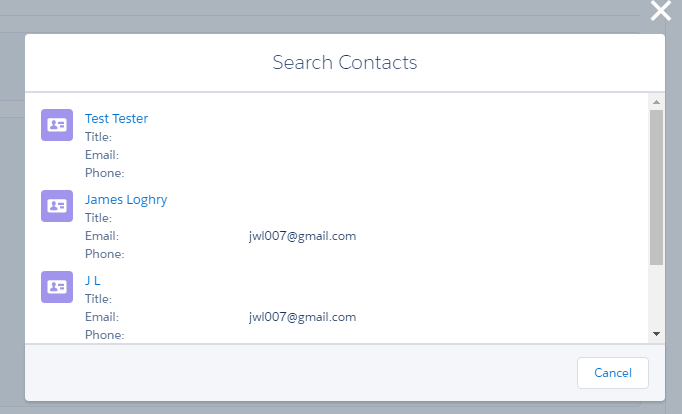

In this module, you create a Lightning Component responsible for displaying the list of contacts and you add the ContactList component to the QuickContacts component.

## What you will learn
- Use component attributes
- Use event handlers
- Use a Lightning Component in another Lightning Component
- Styling a Lightning Component using the Salesforce Lightning Design System (SLDS)


## Step 1: Create the Component

1. In the Developer Console, click **File** > **New** > **Lightning Component**. Specify **ContactList** as the bundle name and click **Submit**

2. Implement the component as follows:

    ```
    <aura:component controller="ContactListController">

        <aura:attribute name="contacts" type="Contact[]"/>
        <aura:handler name="init" value="{!this}" action="{!c.doInit}" />

        <ul>
            <aura:iteration items="{!v.contacts}" var="contact">
                <li>
                    <a href="{! '#/sObject/' + contact.Id + '/view'}">
                        <p>{!contact.Name}</p>
                        <p>{!contact.Phone}</p>
                    </a>
                </li>
            </aura:iteration>
        </ul>

    </aura:component>
    ```

    ### Code Highlights:
    - The controller assigned to the component (first line of code) refers to the **server-side controller** (ContactListController) you created in module 2.
    - The **contacts** attribute is defined to hold the list of Contact objects returned from the server.
    - The **init** handler is defined to execute some code when the component is initialized. That code (**doInit**) is defined in the component's.
**client-side controller** (you'll implement the controller in the next step).
    - ```<aura:iteration>``` is used to iterate through the list of contacts and create an ```<li>``` for each contact


1. Click **File** > **Save** to save the file.


## Step 2: Implement the Controller

1. Click **CONTROLLER**

    

1. Implement the Controller as follows:

    ```
    ({
        doInit : function(component, event) {
            var action = component.get("c.findAll");
            action.setCallback(this, function(a) {
                component.set("v.contacts", a.getReturnValue());
            });
            $A.enqueueAction(action);
        }
    })
    ```

    ### Code Highlights:
    - The controller has a single function called **doInit**. This is the function the component calls when it is initialized.
    - You first get a reference to the **findAll()** method in the component's server-side controller (ContactListController), and store it in the **action** variable.
    - Since the call to the server's findAll() method is asynchronous, you then register a callback function that is executed when the call returns. In the callback function, you simply assign the list of contacts to the component's **contacts** attribute.
    - $A.enqueueAction(action) sends the request the server. More precisely, it adds the call to the queue of asynchronous server calls. That queue is an optimization feature of Lightning.

1. Click **File** > **Save** to save the file


## Step 3: Add ContactList to the QuickContacts Component

1. In the developer console, go back to the **QuickContacts** component.

    If you don't see the tab in the developer console, click **File** > **Open Lightning Resources** in the Developer Console menu, select **QuickContacts** > **COMPONENT** in the dialog, and click the **Open Selected** button.

    


1. Replace the ContactList placeholder with the actual component:

    ```
    <aura:component implements="force:appHostable">

        <c:ContactList/>

    </aura:component>
    ```

    > **c:** is the default namespace for Lightning components

1. Click **File** > **Save** to save the file

1. Reload the Account's record page and click on the Search Contacts Quick Action.  You should see a screen similar to the following:

    

Looks pretty, right?  No?  Well, let's style it using the Salesforce Lightning Design System (SLDS).

## Step 4: Style the ContactList Component using SLDS

In this step, we will style our contact list to use styles from the Salesforce Lightning Design System. SLDS is a set of css files, icons, and other UX pieces that make applications look like Lightning Experience.  If you're interested in reading more about SLDS, or poking around at SLDS examples and components, you can head over to <a href="https://www.lightningdesignsystem.com/">https://www.lightningdesignsystem.com/</a>

Good News!  Lightning Design System is already integrated into Lightning Components.  Although you can, there is no need to include additional stylesheets.

1. Update the Contact List component to utilize a Lightning Design System "Tile" component:

    ```
    <aura:component controller="ContactListController">
        <aura:attribute name="contacts" type="Contact" />
        <aura:handler name="init" value="{!this}" action="{!c.doInit}" />

        <div class="slds">
            <aura:iteration items="{!v.contacts}" var="contact">
                <div class="slds-tile slds-media">
                    <div class="slds-media__figure">
                        <lightning:icon iconName="standard:contact" />
                    </div>
                    <div class="slds-media__body">
                        <h3 class="slds-truncate" title="Salesforce UX"><a href="javascript:void(0);">{!contact.Name}</a></h3>
                        <div class="slds-tile__detail slds-text-body--small">
                            <dl class="slds-dl--horizontal">
                                <dt class="slds-dl--horizontal__label">
                                    <p class="slds-truncate" title="Title">Title: </p>
                                </dt>
                                <dd class="slds-dl--horizontal__detail slds-tile__meta">
                                    <p class="slds-truncate" title="{!contact.Title}">{!contact.Title}</p>
                                </dd>
                                <dt class="slds-dl--horizontal__label">
                                    <p class="slds-truncate" title="Email">Email:</p>
                                </dt>
                                <dd class="slds-dl--horizontal__detail slds-tile__meta">
                                    <p class="slds-truncate" title="{!contact.Email}">{!contact.Email}</p>
                                </dd>
                                <dt class="slds-dl--horizontal__label">
                                    <p class="slds-truncate" title="Email">Phone:</p>
                                </dt>
                                <dd class="slds-dl--horizontal__detail slds-tile__meta">
                                    <p class="slds-truncate" title="{!contact.Phone}">{!contact.Phone}</p>
                                </dd>
                            </dl>
                        </div>
                    </div>
                </div>
            </aura:iteration>
        </div>
    </aura:component>
    ```

2. Click **File** > **Save** to save the file

3. Reload the Account record detail and click on Search Contacts, and you should see the SLDS styles:

    


<div class="row" style="margin-top:40px;">
<div class="col-sm-12">
<a href="create-lightning-application.html" class="btn btn-default"><i class="glyphicon glyphicon-chevron-left"></i> Previous</a>
<a href="create-searchbar-component.html" class="btn btn-default pull-right">Next <i class="glyphicon glyphicon-chevron-right"></i></a>
</div>
</div>
