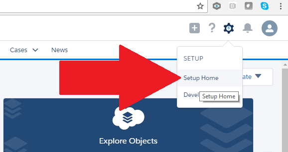
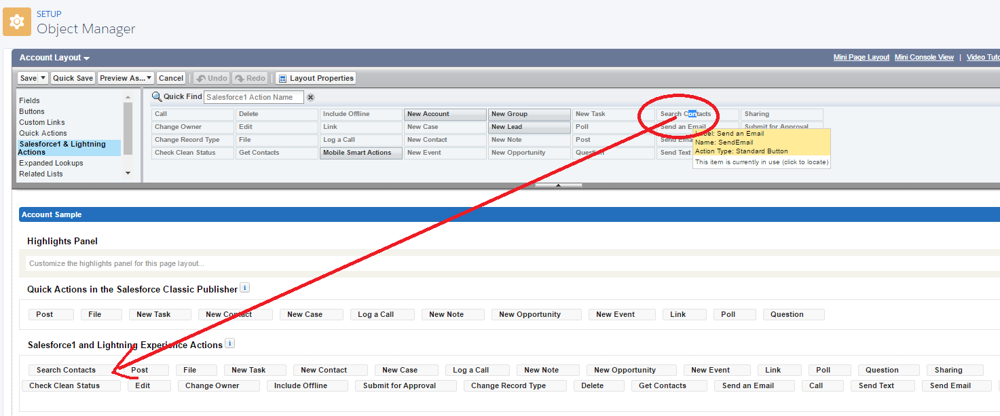
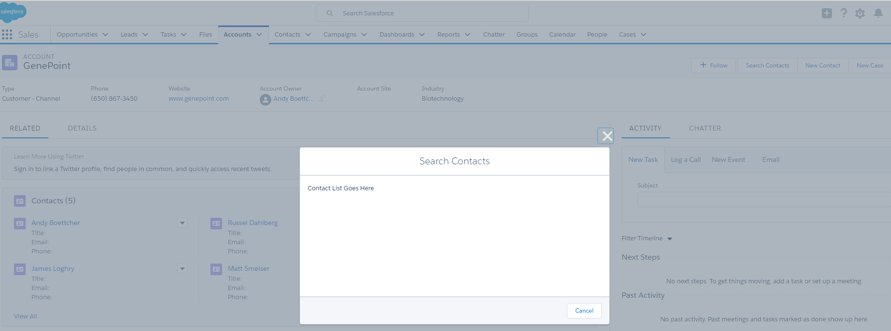

In this module, you will learn how to use an interface to expose a Lightning Component as a Quick Action.

## What you will learn
- Enabling Lightning Experience
- Lightning Component interfaces, and how you can expose a component for use in a Quick Action.
- Nesting Lightning Components.
- Testing a Lightning Component Quick Action.

## Step 1: Create the Component

1. In the Developer Console, click **File** > **New** > **Lightning Component**. Specify **QuickContacts** as the bundle name and click **Submit**

2. Implement the component as follows:

    ```
    <aura:component implements="force:lightningQuickAction,force:hasRecordId">

        <p>ContactList goes here</p>

    </aura:component>
    ```

    ### Code Highlights:
    - The component implements the **force:lightningQuickAction** interface to indicate that it can run as a Lightning Quick Action.
    - The component implements the **force:hasRecordId** which allows the component to run with an instance of a particular record.
    - Lightning components can include other Lightning components and regular HTML markup

1. Click **File** > **Save** to save the file

## Step 2: Enable Lightning Experience
1. In Setup, Click on "Lightning Experience" near the top.  If you can't find it, use the Quick Search functionality.
2. Scroll to the bottom of the Lightning Experience screen, and enable "Lightning Experience" by toggling the switch on.
3. Click on your username, then click "Switch to Lightning Experience" and watch the magic happen.
    - 
    
## Step 3: Create the Quick Action
1. Open Setup in LEX.  It's still in the top right of the screen, just looks a bit different:
    - 
2. In Setup, Click Object Fields->Object Manager
3. Click Account.
4. Under Buttons, Links, and Actions, click 'New Action'.
5. Specify the following:
    - Action Type: Lightning Component
    - Lightning Component: QuickContacts
    - Name: Search Contacts
    - Label: Search_Contacts
6. Click Save.

## Step 4: Add the action to the Account Page Layout
1. In Setup, go to Object Manager.  Click Account.
2. Go to the "Layouts" section and click on the Account layout.
3. Click the wrench on the "Salesforce1 and Lightning Experience Actions" area on the page layout to enable it for editing.
4. Drag the Search Contacts action from the "Salesforce1 & Lightning Actions" area of the layout pallette to the "Salesforce1 and Lightning Experience Actions" area on the page layout.
    - 

## Step 5: Test the Quick Action
1. Go to an Account in Lightning Experience.
2. The Quick Action should show up in the top right of the screen as a Quick Action.
3. Click on "Search Contacts", and you should see a screen similar to the following:
   - 

<div class="row" style="margin-top:40px;">
<div class="col-sm-12">
<a href="create-apex-controller.html" class="btn btn-default"><i class="glyphicon glyphicon-chevron-left"></i> Previous</a>
<a href="create-contactlist-component.html" class="btn btn-default pull-right">Next <i class="glyphicon glyphicon-chevron-right"></i></a>
</div>
</div>
